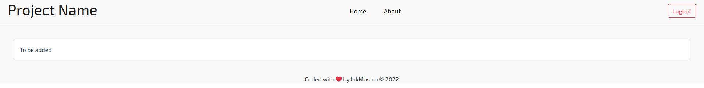

# Vue Template

A simple, barebone Vue template made for projects that need a navbar and it's not admin.



## Technologies used

* Vue 3, configured with JavaScript (no TypeScript here)
* Bootstrap
* VueX
* Vue Router

## Requirements

* node with a package manager like npm or yarn

## How to run

```bash
npm run dev # or
yarn dev
```

## Known problems

* Navbar is not 100% responsive.

### Contribute

Do a PR and I will manage to update it if it works. :)

## License

MIT - &copy; IakMastro free to use by anyone

## Cheers ✌️

Iakovos "IakMastro" Mastrogiannopoulos
